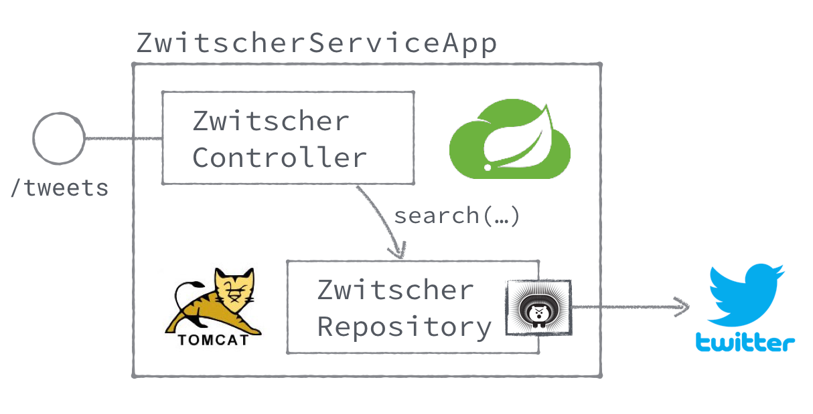

# Exercise 1: Microservices



## Step 01: Project Creation using Spring Initializr

First, we are going to create our Twitter microservice using the Spring Initializr.
For this go to the following URL: https://start.spring.io

* Select Gradle as build tool.
* Enter the Group ID and Artifact Name.
* Select the following dependencies:
  * Actuator
  * Hystrix
  * Twitter
  * Web

Switch to the full version of the wizard to further customize the project. When
done, press the `Download` button. Extract and copy the downloaded archive to
your workspace directory.

Now you can import the Gradle project into your IDE. You should also be able to
compile and run the project without any errors on the command line using:
```bash
$ ./gradlew bootRun
```

## Step 02: Implement Zwitscher REST Endpoint

Next we implement a basic Spring based REST endpoint to return a list of Tweets upon a simple
`GET /tweets` request. For now simply return a dummy string. As a bonus, implement a simple
JUnit test to check for the correct behaviour.

```java
@RestController
@RequestMapping("/tweets")
public class ZwitscherController {
    @RequestMapping(method = RequestMethod.GET, produces = MediaType.APPLICATION_JSON_UTF8_VALUE)
    public HttpEntity<Collection<String>> tweets() {
        return new ResponseEntity<>(Collections.singleton("Hello World."), HttpStatus.OK);
    }
}
```

## Step 03: Implement Twitter social connectivity

Next we will us the Spring Cloud Twitter library to query for a number of tweets and return these
via our Zwitscher REST endpoint. We will create a `ZwitscherRepository` as abstraction to access
the Twitter API, configure the Twitter beans and use the repository in our REST endpoint.

* Create the Zwitscher respository

```java
@Repository
public class ZwitscherRepositoryImpl implements ZwitscherRepository {

    private final Twitter twitter;

    @Autowired
    public ZwitscherRepositoryImpl(Twitter twitter) {
        this.twitter = twitter;
    }

    @Override
    public Collection<String> search(String q, int pageSize) {
        // search and map results
        SearchResults results = twitter.searchOperations().search(q, pageSize);
        return results.getTweets().stream()
                .map(Tweet::getUnmodifiedText)
                .collect(toSet());
    }
}
```

* Create the Twitter bean configuration

```java
@Configuration
public class ZwitscherConfiguration {
    @Bean
    public Twitter twitter(final @Value("${spring.social.twitter.appId}") String appId,
                           final @Value("${spring.social.twitter.appSecret}") String appSecret) {
        return new TwitterTemplate(appId, appSecret);
    }
}
```

* Wire and use the repository

```java
@RequestMapping(method = RequestMethod.GET, produces = MediaType.APPLICATION_JSON_UTF8_VALUE)
public HttpEntity<Collection<String>> tweets() {
    Collection<String> tweets = repository.search("cloudnativenerd", 23);
    return new ResponseEntity<>(tweets, HttpStatus.OK);
}
```

## Step 04: Add Hystrix circuit breaker

Since the Twitter API might be slow or even not be reachable, we need to enhance our Zwitscher repository
with basic circuit-breaker capabilities to stay responsive in the face of failure.

Firsrt we simply need to apply the `@EnableCircuitBreaker` annotation to our Spring Boot application class.
This will enable Hystrix.

Then we can enhance our repository implementation to wrap the call to the search method in a Hystrix command.
We also want to specify a fallback method in case the call takes too long.

```java
@Override
@HystrixCommand(fallbackMethod = "noResults", commandProperties = {
    @HystrixProperty(name = "execution.isolation.thread.timeoutInMilliseconds", value = "5000")
})
public Collection<String> search(String q, int pageSize) {
    SearchResults results = twitter.searchOperations().search(q, pageSize);
    return results.getTweets().stream()
            .map(Tweet::getUnmodifiedText)
            .collect(toSet());
}

@SuppressWarnings("unused")
protected Collection<String> noResults(String q, int pageSize) {
    return Collections.singleton("Error getting Tweet stream. Using fallback.");
}
```

Play around with the execution timeout property and see how it behaves if you set it to a really low value.
