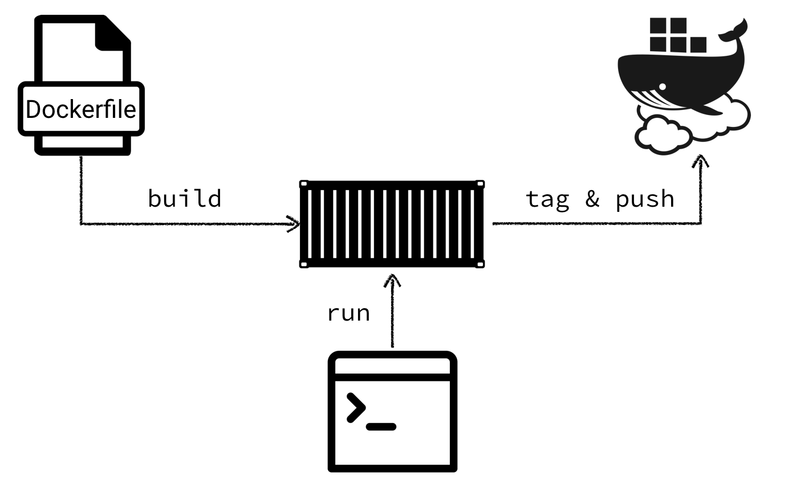

# Exercise 2: Containerization



## Step 01: Writing a Dockerfile for our microservice

Next, we need to containerize our micro service application. For this we have to write a `Dockerfile`
with the required commands to package and run our application.

* Create a file `Dockerfile` in the root directory of your workspace.
* Choose your Java base image wisely! Size does matter.
    * openjdk:8u102-jdk
    * openjdk:8u92-jdk-alpine
    * qaware-oss-docker-registry.bintray.io/base/centos7-jre8
    * qaware-oss-docker-registry.bintray.io/base/debian8-jre8
    * qaware-oss-docker-registry.bintray.io/base/alpine-k8s-ibmjava8
* Copy the executable JAR and configuration files to the Docker image.
* Defined required environment variables and expose ports.
* Define the start command for the micro service JAR.

Tip: the Spring Boot JAR file can be enhanced with a shell script and made executable.
See http://docs.spring.io/spring-boot/docs/current/reference/html/deployment-install.html


## Step 02: Building and running the Docker image locally

In this step we will build the Docker image and run it using the CLI as well as Gradle. Building the
image is pretty straight forward. In the project directory issue the following command:

```bash
$ docker build -t zwitscher-service:1.0.0 .

$ docker images
```

You should now see the newly built Docker image in the list of available images. You should also see the
base image you have used in this list.

Building the Docker image every time you change something on the application can be cumbersome. What we need
instead is the tight integration with our build tool, so that we can build the Docker image as part of our CI
build cycle. We will be using the Gradle Docker plugin https://github.com/bmuschko/gradle-docker-plugin

```gradle
task buildDockerImage(type: DockerBuildImage) {
    inputDir = projectDir
    noCache = false
    remove = true
    tag = "$project.name:$version"
}

task removeDockerImage(type: DockerRemoveImage) {
    imageId = "$project.name:$version"
}
```

Once we have built the Docker image it is time to run the Zwitscher service in a container for th first time. Explore
the `docker run` command for the various possibilities. First of all, it is possible to run the container in the
foreground as well as background. For the container to run successfully, you need to pass the Twitter credentials as
environment variables.

```bash
$ docker run -it -p 8080:8080 zwitscher-service:1.0.0

$ docker run -it -e "TWITTER_APP_ID=..." -e "TWITTER_APP_SECRET=..." -p 8080:8080 zwitscher-service:1.0.0

$ docker run --name zwitscher-service -d \
        -e "TWITTER_APP_ID=..." -e "TWITTER_APP_SECRET=..." \
        -p 8080:8080 zwitscher-service:1.0.0

$ docker ps
$ docker logs -f zwitscher-service

$ docker stop zwitscher-service
$ docker start zwitscher-service
```

Try experimenting with some other options Docker provides:

* Add memory constraints when starting the container (do not make them too small!)
* Add CPU constraints when starting the container
* Add health checks against the Actuator health endpoint

```bash
$ docker run --name zwitscher-service \
        --cpu-quota 50000 --memory 256m --memory-swappiness 0  \
        --health-cmd='curl localhost:8080/health' --health-interval=5s \
        -d -e "TWITTER_APP_ID=..." -e "TWITTER_APP_SECRET=..." \
        -p 8080:8080 zwitscher-service:1.0.0

$ docker ps
$ docker logs -f zwitscher-service

$ docker stop zwitscher-service
$ docker start zwitscher-service
```

## Step 03: Push image to remote Docker registry

The final step is to tag and push the final Docker image to a remote Docker registry such as Docker Hub.
First, we need to tag image with the remote registry URL.

```bash
$ docker tag zwitscher-service:1.0.0 <username>/zwitscher-service:1.0.0
$ docker tag zwitscher-service:1.0.0 <username>/zwitscher-service:latest
```

Next, we need to login at the remote Docker registry and then push the image to there. Once this is
done, have a look at Docker Hub.

```bash
$ docker login -e <email> -u <username> -p <password>
$ docker push <username>/zwitscher-service
```
